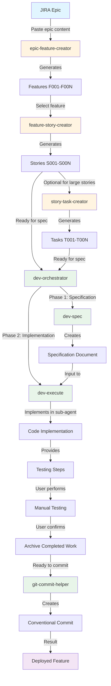
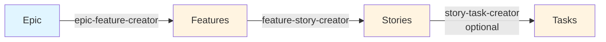
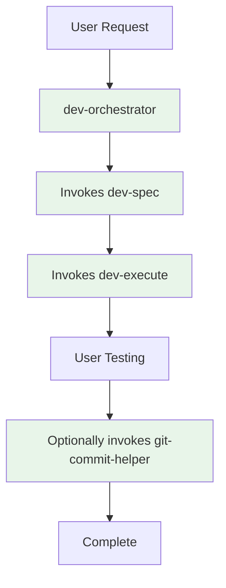
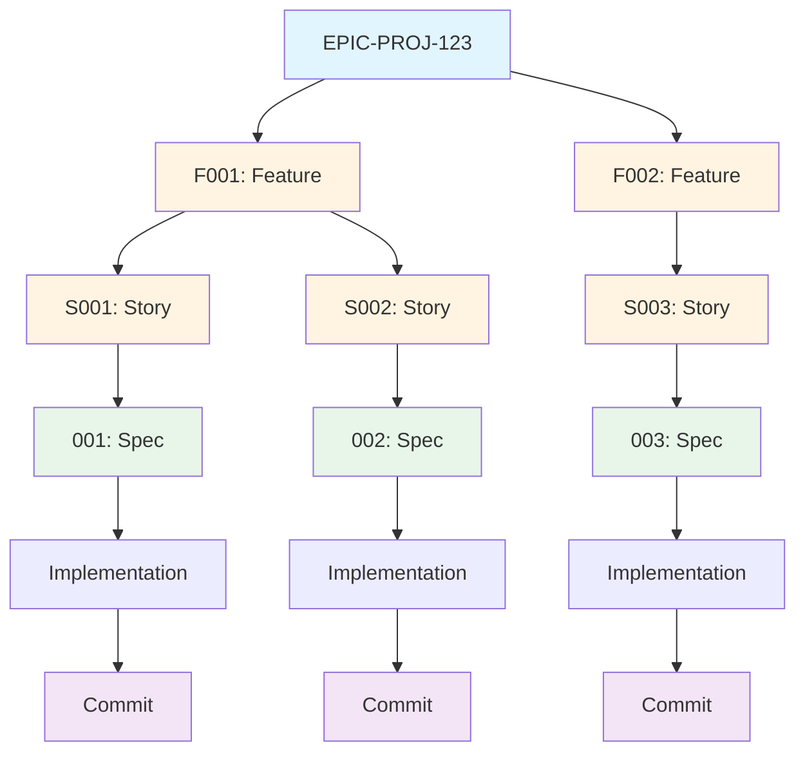

# Skills Intended Workflow

This document illustrates the high-level workflow showing how agile-skills and dev-skills work together to transform JIRA epics into deployed code.

## Complete Workflow: Epic to Deployment



## Workflow Phases

### Phase 1: Decomposition (agile-skills)


**Skills involved:**
- **epic-feature-creator**: JIRA epics → Technical features
- **feature-story-creator**: Features → User stories
- **story-task-creator**: Large stories → Sub-tasks (optional)

### Phase 2: Specification (dev-skills)


**Skills involved:**
- **dev-spec**: Creates adaptive specifications (lightweight for simple tasks, comprehensive for complex features)

### Phase 3: Implementation (dev-skills)


**Skills involved:**
- **dev-execute**: Implements specification in fresh sub-agent context
- Provides testing steps
- Archives after user confirmation

### Phase 4: Commit (dev-skills)


**Skills involved:**
- **git-commit-helper**: Generates conventional commit messages from git diffs

## Orchestration

### dev-orchestrator: End-to-End Workflow


**dev-orchestrator** can handle the complete workflow from story/task to deployed code:
- Automatically invokes dev-spec for specification
- Automatically invokes dev-execute for implementation
- Manages testing and completion phases
- Can optionally create commits

## Typical Usage Patterns

### Pattern 1: Full Epic Decomposition
```bash
# Start with epic
/epic-to-features
[Paste JIRA epic]

# Break into stories
/feature-to-stories F001

# Implement each story
/dev-orchestrator S001
/dev-orchestrator S002
/dev-orchestrator S003
```

### Pattern 2: Direct Story Implementation
```bash
# Already have story defined, go straight to implementation
/dev-orchestrator "Implement user login form"
```

### Pattern 3: Manual Step-by-Step
```bash
# Create spec
/dev-spec S001

# Review spec, then implement
/dev-execute 001

# Test, confirm, then commit
/git-commit-helper
```

## Artifact Traceability



Each artifact maintains references to its parent, creating complete traceability from commit back to original epic.

## Legend

- 🔵 **Blue**: Input (JIRA, user requests)
- 🟡 **Yellow**: agile-skills (decomposition)
- 🟢 **Green**: dev-skills (execution)
- 🟣 **Purple**: Output (deployed code)

---

**Last Updated:** 2025-11-21